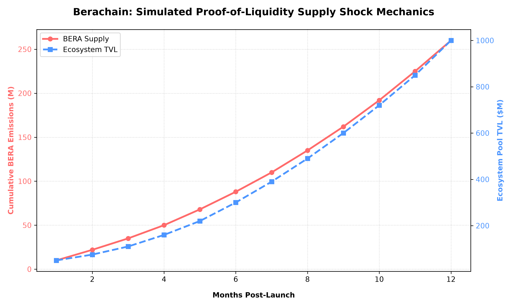

# Institutional Analysis: Berachain Proof-of-Liquidity (PoL) & Tri-Token Flywheel

An analytical deep-dive into the economic sustainability, value capture mechanisms, and structural risks of Berachain's multi-token architecture.

---

## Executive Summary
Berachain addresses a core flaw in traditional Proof-of-Stake (PoS) networks: liquidity leakage. By decoupling the network's gas token from its governance/consensus architecture, Berachain forces capital to remain productive within the ecosystem's decentralized exchanges (DEXs) and lending markets to earn validation rights. 

This report evaluates how the **Tri-Token system** balances systemic inflation against liquidity retention.

---

## 1. The Tri-Token Framework Explained

Unlike single-token networks, Berachain segments its economy into three specific primitives:

| Token | Type | Primary Function | Value Capture Mechanism |
| :--- | :--- | :--- | :--- |
| **BERA** | Gas Token | Network transaction execution. | Burnt via EIP-1559 style mechanics; required to interact with all primitives. |
| **BGT** | Governance (Soulbound) | Dictates BERA inflation rewards to liquidity pools. | Non-transferable. Can only be earned by providing liquidity to whitelisted pools. |
| **HONEY** | Stablecoin | Ecosystem peg ($1.00 USD). | Over-collateralized stable asset acting as the primary clearing currency. |

### The Flywheel Mechanics
1. Users deposit capital into whitelisted liquidity pools.
2. Depositors earn **BGT** (non-transferable governance tokens).
3. BGT holders delegate their tokens to validators.
4. Validators use that governance weight to direct new **BERA** emissions back to specific pools, creating a localized yield flywheel.

---

## 2. Supply Dynamics & Quantitative Modeling

The relationship between BERA inflation distributions and sticky Total Value Locked (TVL) is highly codependent. If the incentive value of BERA drops, capital flight risks increase exponentially.

Below is a 12-month simulation tracking the projected velocity of BERA emissions relative to targeted Ecosystem Pool growth under optimal validation weight delegation:



### Key Takeaway from Model:
The chart highlights a critical "Velocity Threshold" around Month 6. As cumulative BERA emissions scale linearly, the ecosystem must scale its TVL exponentially to protect the token from inflationary sell-pressure. This places massive pressure on the **HONEY** stablecoin minting volumes to absorb market volatility.

---

## 3. Structural Risks & SWOT Analysis

### Strengths
* **Sticky Liquidity:** Yield hunters cannot easily mercenary-farm and leave, as earning governance weight requires deep alignment with ecosystem pools.
* **Decoupled Security:** Sudden price drops in the gas asset (BERA) do not immediately degrade network security thresholds, which are protected by delegated BGT.

### Vulnerabilities & Attack Vectors
* **Whale Governance Cartels:** Large venture capital firms or protocols can accumulate disproportionate amounts of BGT early on. This allows them to permanently vote BERA emissions exclusively to their own pools, starving native, community-led protocols of liquidity.
* **Stablecoin De-peg Contagion:** Because HONEY is deeply integrated as the base pair for lending and leverage, any algorithmic or systemic failure of its underlying collateral will instantly trigger cascading liquidations across the network's native AMMs.

---

## How to Run the Analytical Model Locally

To regenerate the high-resolution visualization or tweak the economic projection variables, clone this repository and execute the underlying script:

```bash
# Clone the repository
git clone [https://github.com/Hope873/berachain-tokenomics-analysis.git](https://github.com/Hope873/berachain-tokenomics-analysis.git)
cd berachain-tokenomics-analysis

# Install dependencies
pip install matplotlib numpy

# Run the simulator
python scripts/generate_charts.py
